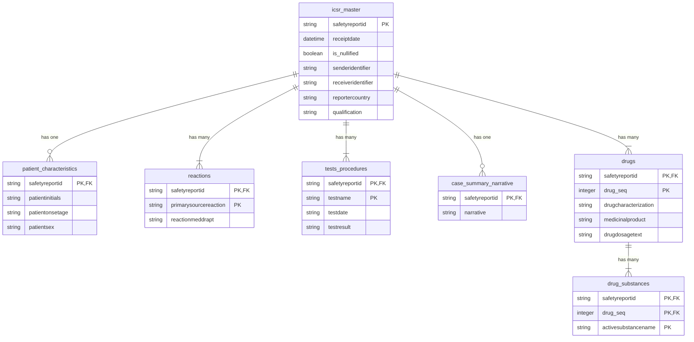

# Database Schema

The package supports two target schemas: **Normalized** and **Audit**.

## 1. Normalized Schema

This is the default schema, designed for analytical querying and ease of use. It normalizes the complex E2B(R3) structure into a set of related relational tables.

### Entity-Relationship Diagram (ERD)

Below is a simplified ERD showing the relationships between the primary tables.

### Metadata Tables

In addition to the data tables, the loader creates and maintains a metadata table:

*   `etl_file_history`: Tracks every file processed by the ETL.
    *   `filename`: The name of the source file.
    *   `file_hash`: The SHA-256 hash of the file content, used for delta detection.
    *   `status`: The final status of the load (`completed`, `failed`, etc.).
    *   `rows_processed`: The number of records processed from the file.
    *   `load_timestamp`: When the file was processed.

## 2. Audit Schema

This schema is designed for data provenance and completeness. It consists of a single primary table.

*   `icsr_audit_log`:
    *   `safetyreportid`: The unique ICSR identifier.
    *   `receiptdate`: The date of the report, used for versioning.
    *   `icsr_payload`: A **JSONB** column containing the complete, unmodified ICSR data as a JSON object. This allows for detailed inspection and querying of the original data.
    *   `etl_load_timestamp`: When the record was loaded.

This schema also uses the `etl_file_history` table for tracking processed files.
